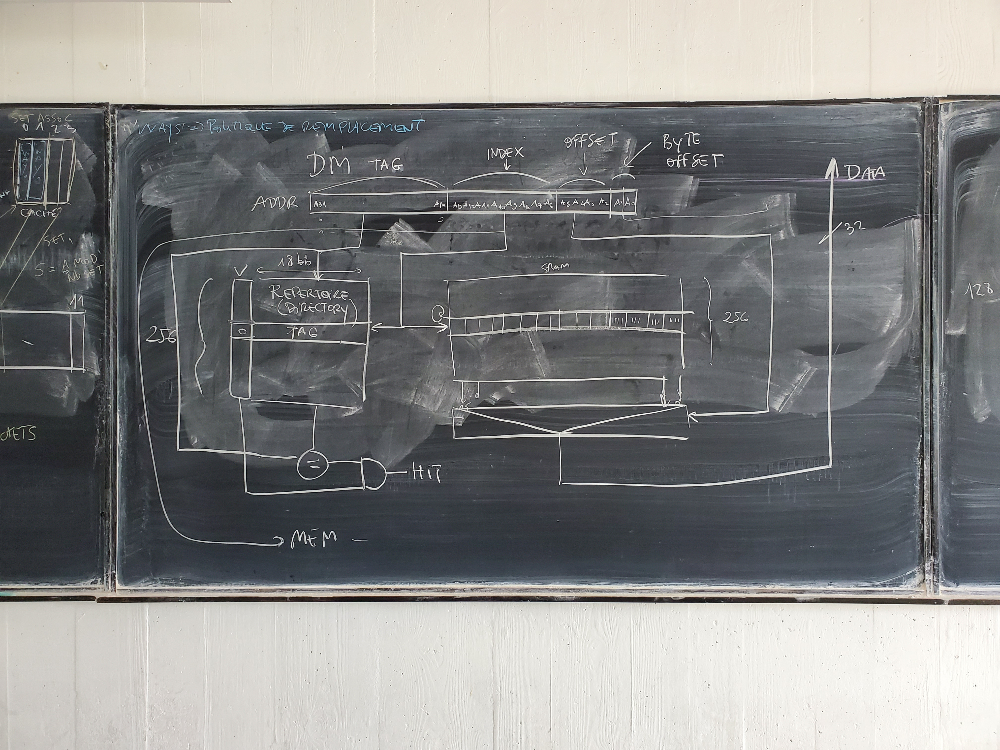
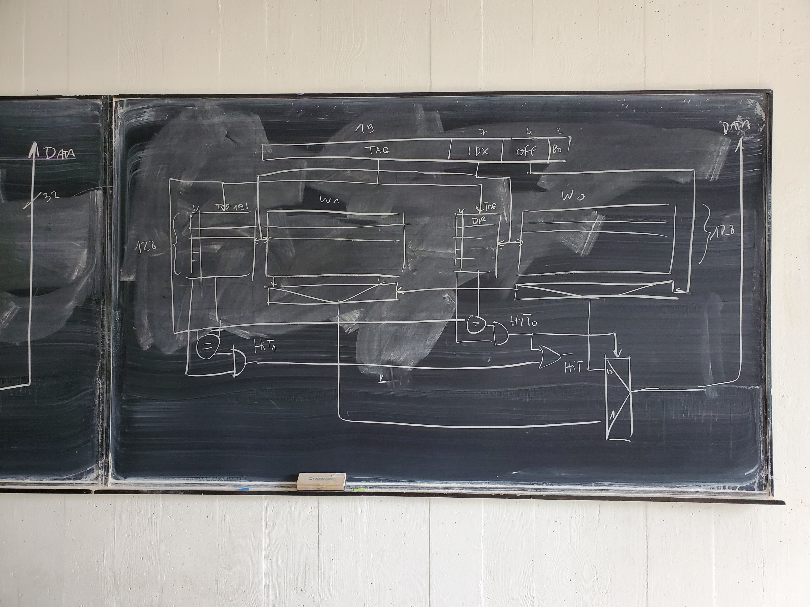

# Quelques informations en complément des documents

## Examen 2022 d'Arthur Perais
L'examen dure 2 heures, et voici celui de l'année passée : 
## Breaking news

André Seznec gagne le prix de l'innovation de l'INRIA : https://www.academie-sciences.fr/fr/Laureats/laureats-2022-des-prix-inria-catuscia-palamidessi-andre-seznec-et-xavier-allamigeon.html


## CM n°0 et 1

### Introduction sur les caches

Programme qui met en évidence le comportement du cache:
```C
echo '
#include <stdint.h>
volatile double x[1024][1024] = {{1.,1.}};
int main(void)
{
   int32_t i, j, k;
   /* On répète 1024 fois pour avoir un temps significatif */
   for (k = 0; k < 1024; k++)
       for (i = 0; i < 1024; i++)   /* i : indice des colonnes */
           for (j = 0; j < 1024; j++) /* j : indice des lignes */
            x[i][j] = 2 * x[i][j]+k;
   return 0;
}' | gcc -O3 -x c -o cache - && perf stat -d ./cache
```
Et on refait la même chose en échangeant les 2 boucles les plus imbriquées.
On peut remplacer `perf ...` par `time` si on juste voir les temps.

Question : que se passe-t-il si l'on retire le qualificatif `volatile` au tableau `x` ? Pourquoi ?

Principe du cache et emplacements possibles des lignes de mémoire: 

Design d'un cache à correspondance directe: 
Design d'un cache associatif par ensemble, avec 128 ensembles de 2 voies chacun: 

Ajout du remarquable travail de Master de Damien Gille (qui travaille chez ArianeEspace après être passé chez ARM) sur les politiques de remplacement dans les caches.

## CM n°2
Le pipeline sa vie son œuvre, RAS.

## CM n°3
En cours

